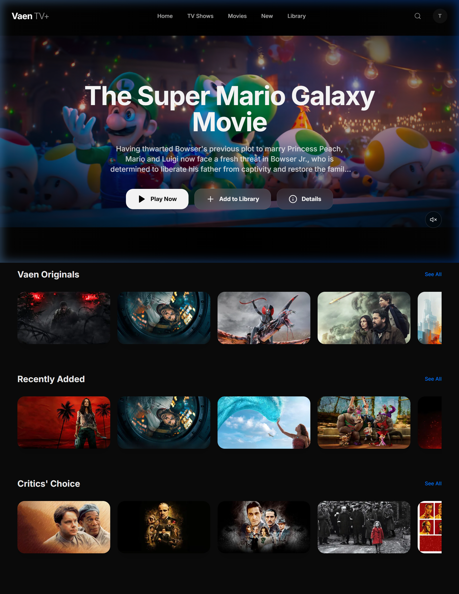

# Vaen TV+ 🎬

[](https://vaentv.vercel.app/)

A premium, high-fidelity movie discovery and streaming platform inspired by the sleek aesthetics of Apple TV. Built with a modern full-stack architecture, featuring personalized AI recommendations and an immersive user experience.



## ✨ Premium Experience

Vaen TV+ is designed for those who appreciate visual excellence. With a focus on **glassmorphism**, **vibrant typography**, and **fluid animations**, it offers more than just a movie list—it offers a cinematic journey.

### 🌟 Key Features

- **Vaen ID Auth**: Secure, unified authentication system (Rebranded from Apple ID).
- **Immersive UI**: Glassmorphic components, backdrop-driven dynamic themes, and smooth Framer Motion transitions.
- **AI-Powered Discovery**: Intelligent "Recommended for You" engine using content-based filtering.
- **Cinematic Trailers**: Integrated high-definition video player with auto-play previews.
- **Smart Search**: Real-time, debounced global search across thousands of titles via TMDB.
- **Personal Library**: One-click watchlist management to save your favorite movies and shows.

---

## 🚀 Quick Start

### Live Link
Access the production deployment here: [**https://vaentv.vercel.app/**](https://vaentv.vercel.app/)

### Local Installation

#### 1. Backend (FastAPI)
```bash
cd backend
python -m venv .venv
# Activate venv: .\.venv\Scripts\activate (Windows) or source .venv/bin/activate (Unix)
pip install -r requirements.txt
# Configure .env with TMDB_API_KEY and DATABASE_URL
uvicorn main:app --reload
```

#### 2. Frontend (React + Vite)
```bash
cd frontend
npm install
npm run dev
```

---

## 🛠️ Tech Stack

- **Frontend**: `React 18`, `Vite`, `Tailwind CSS`, `Framer Motion`, `Lucide React`.
- **Backend**: `FastAPI`, `SQLAlchemy`, `PostgreSQL`, `Scikit-Learn` (ML).
- **External API**: `TMDB API` for real-time movie metadata.

---

## 🎨 Design Philosophy

The project adheres to "Google Health" inspired minimalism merged with "Apple" premium aesthetics:
- **SF Pro** inspired typography for maximum readability.
- **Subtle Gradients** and depth through multi-layered shadows.
- **Micro-interactions** that make the interface feel alive.

Created with passion for the ultimate viewing experience. 🍿
